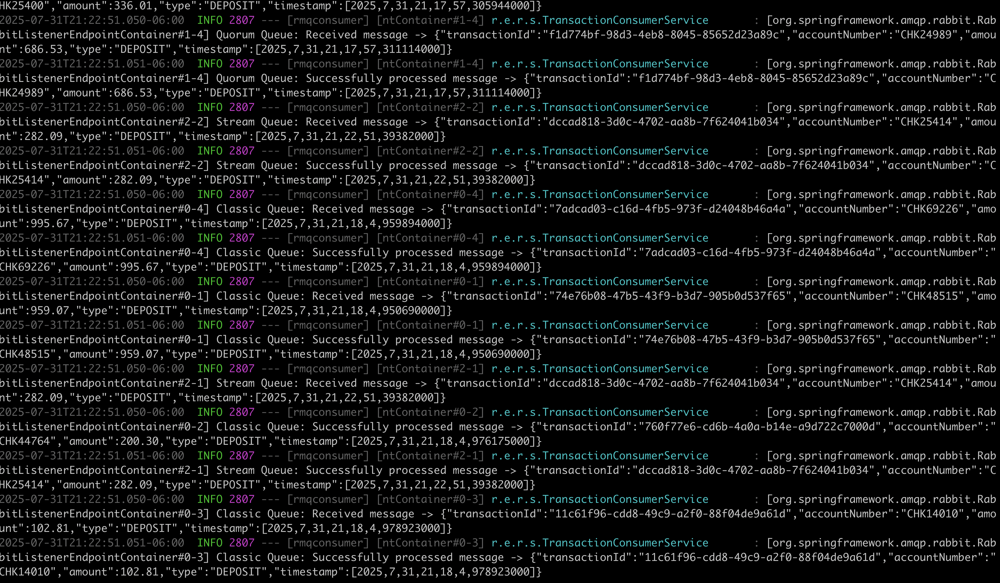
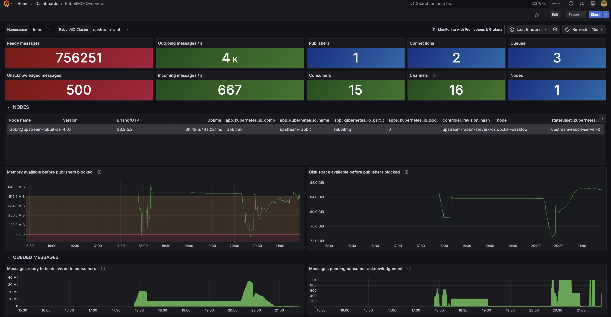
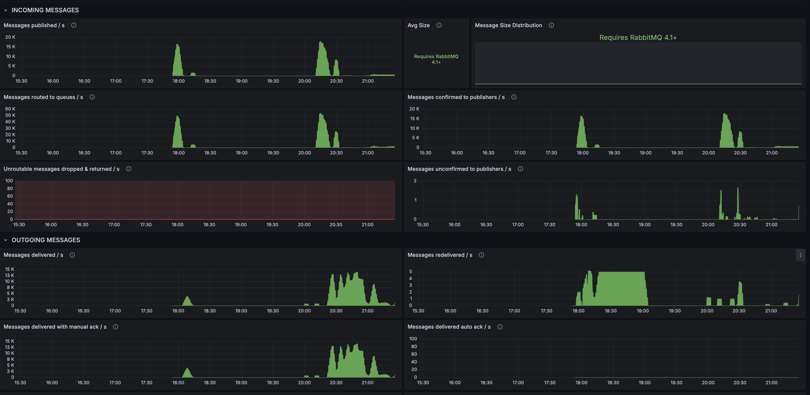
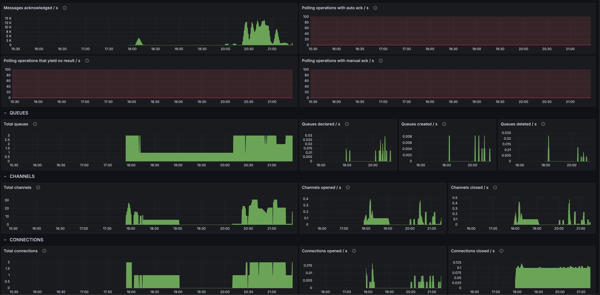

# RabbitMQ Consumer Application

This project is a Spring Boot application that consumes messages asynchronously from multiple RabbitMQ queues and a fanout exchange. It provides a Vaadin-based dashboard to monitor queue statistics and consumption metrics.

## Features

- Consumes messages from:
  - `classic.transactions`
  - `quorum.transactions`
  - `stream.transactions`

- Manual acknowledgment for reliable message processing (configurable).

- Configurable concurrency and prefetch for high throughput.

The application uses manual acknowledgment, which ensures that a message is only removed from the queue after it has been successfully processed by the consumer. This provides a higher level of reliability than automatic acknowledgment. The concurrency and prefetch settings are highly configurable, allowing you to tune the application for high throughput scenarios.


## RabbitMQ Queue Policies

Example policies for queue limits and overflow handling:

These policies define message limits and overflow behavior for your queues. This is crucial for preventing queues from growing indefinitely and consuming excessive memory.

```sh
rabbitmqctl set_policy q-pol "quorum.transactions" \
  '{"max-length":1000,"overflow":"reject-publish"}' \
  --apply-to queues

rabbitmqctl set_policy s-pol "stream.transactions" \
  '{"max-length":1000,"overflow":"reject-publish"}' \
  --apply-to queues

rabbitmqctl set_policy c-pol "classic.transactions" \
  '{"max-length":10000,"overflow":"reject-publish"}' \
  --apply-to queues
```

#### Consumer Timeout

This policy ensures that consumers don't hold messages for too long without acknowledging them. If a consumer fails, this setting can help release the message back to the queue for another consumer to process.

```
rabbitmqctl set_policy all ".*" '{"consumer-timeout":5000}'
```


## Consumer Timeout Policy Example

Override consumer timeout for a group of queues:


```sh
rabbitmqctl set_policy queue_consumer_timeout "with_delivery_timeout.*" \
  '{"consumer-timeout":5000}' --apply-to classic_queues
```

## Configuration

Edit `src/main/resources/application.properties` to set RabbitMQ connection details:

```properties
spring.rabbitmq.host=localhost
spring.rabbitmq.port=5672
spring.rabbitmq.username=arul
spring.rabbitmq.password=password
server.port=8082
```

## Running the Application

1. Ensure RabbitMQ is running and queues/exchanges are configured.
2. Build and start the Spring Boot application:

### Build and Run the Application

```
mvn clean package
```

```
mvn spring-boot:run
```
### Running multiple instances of application

To simulate a clustered environment, you can run multiple instances of the application on different ports. This is useful for testing load balancing and consumer behavior with multiple workers.

```
mvn spring-boot:run -Dspring-boot.run.arguments=--server.port=8085
```

#### Application logs screenshot




### Monitoring via Prometheus & Grafana






## Customization

- Adjust concurrency and prefetch in `RabbitConfig.java` for performance tuning.
- Update queue policies as needed for your workload.

---

For more details on RabbitMQ policies and management, see the [RabbitMQ Documentation](https://www.rabbitmq.com/documentation.html).
